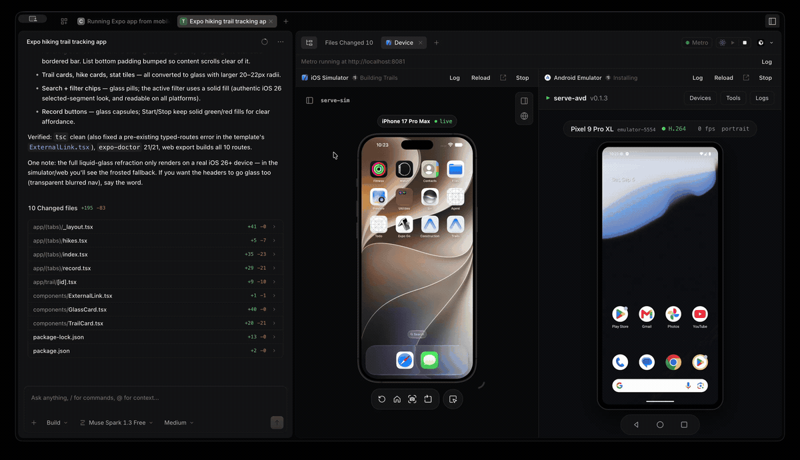
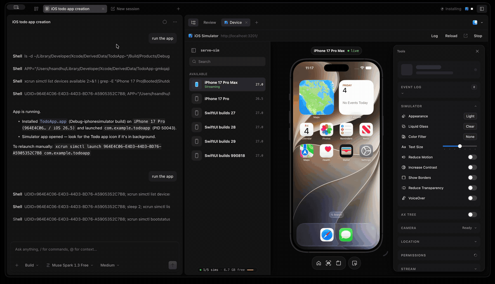

<h1 align="center">mobilecode</h1>
<p align="center">The open source AI coding agent for mobile apps.</p>

MobileCode is a fork of [opencode](https://github.com/anomalyco/opencode) that knows about mobile projects. When it detects an iOS or Android project it can run the simulator or emulator preview server and render the live device inside the app, next to your session.

### React Native

Run a React Native app on iOS, Android, or both using independent controls. The React Native button starts Metro only. Each platform's Play button starts its virtual device and embedded stream, then builds, installs, and launches the current tab's project. Metro is started automatically when needed and shared by both platforms.

<p align="center">
  
</p>

<p align="center">
  
</p>

- **iOS**: detects Xcode projects and workspaces, CocoaPods, and Expo apps, then runs [serve-sim](https://github.com/EvanBacon/serve-sim) and embeds the iOS Simulator stream.
- **Android**: detects Gradle projects and Expo apps, then runs [serve-avd](https://github.com/hsandhu/serve-avd) and embeds the Android Emulator stream.
- **Expo and React Native**: Play generates the native project with `expo prebuild` when needed, installs pods, starts Metro, and connects the emulator to it through `adb reverse`. One Metro serves both platforms.
- **Agent-driven runs**: the `device_run` tool lets the agent build and launch the app itself, wait for the result, and read the build error and log tail, so it can fix a failing build without you pasting logs. The device pane opens when a run starts.
- **Independent platforms**: starting a project replaces only the previous run on that platform. Opening the pane or switching tabs never starts a device or build. Metro uses one shared port; if another project's Metro owns it, stop that Metro explicitly before running a different JavaScript project.
- Everything else opencode does: terminal UI, desktop app, web UI, any model provider, MCP, plugins, and skills.

### How the device pane works

Open a session in a mobile project and the device pane opens by itself, alongside your conversation, without starting anything. Its Start and Stop controls perform the same full lifecycle as the toolbar controls. Running a platform starts `npx serve-sim` or `npx serve-avd` on the machine running the MobileCode server, pinned to the device used by the build. Reload refreshes only the stream. Projects are detected up to two directories below the session root, so an app in a subfolder is still found. Each platform has a build-log toggle, and the shared Metro status bar has its own log toggle.

### Build and run

The session titlebar carries an Xcode-style run control for every detected platform, showing the current build status next to it.

- **Play** starts the selected platform's virtual device and stream, builds the native project, installs it on that same device, and launches it. On iOS that is `xcodebuild` against the first shared scheme, then `simctl install` and `simctl launch`. On Android it is `./gradlew :<module>:assembleDebug`, then `adb install -r -g` and an explicit launch intent. Expo uses `expo prebuild` when needed followed by this native pipeline, rather than invoking `expo run:ios` or `expo run:android` directly.
- **Stop** cancels an in-flight build, terminates the app, closes its stream, and shuts down its simulator or emulator. The other platform remains running. Metro started with the React Native button stays running until explicitly stopped; automatically started Metro stops after its last app stops.
- Status moves through Building, Installing, Launching and Running, and a failed build shows the first compiler or Gradle error with the full log one click away in the device pane.

The same operations are available over HTTP:

```
GET  /api/device-preview?location[directory]=<project>
POST /api/device-preview/start      { "platform": "ios" | "android" }
POST /api/device-preview/stop       { "platform": "ios" | "android" }
POST /api/device-preview/run        { "platform": "ios" | "android" }
POST /api/device-preview/run/stop   { "platform": "ios" | "android" }
```

Requirements: macOS with Xcode for iOS (serve-sim needs Node 20 or newer), and the Android SDK platform-tools with at least one AVD for Android. Android builds need a JDK your project's Gradle version supports, and the package name is read from the built APK with `aapt2` when the SDK build-tools are installed.

### Installation

```bash
# Install script (downloads a release binary from GitHub)
curl -fsSL https://raw.githubusercontent.com/hsandhu/mobilecode/main/install | bash

# From source
git clone https://github.com/hsandhu/mobilecode.git
cd mobilecode
bun install
bun run --cwd packages/opencode src/index.ts
```

The install script places the binary in `~/.mobilecode/bin` and adds it to your shell PATH.

### Configuration and data

MobileCode keeps opencode's configuration format and locations, so an existing `opencode.json`, provider credentials, plugins, and skills work unchanged. Configuration lives in `~/.config/opencode`, data in `~/.local/share/opencode`, and environment variables keep the `OPENCODE_` prefix. See the [opencode docs](https://opencode.ai/docs) for the full reference.

### Development

```bash
bun install
bun run --cwd packages/opencode src/index.ts serve --port 4096   # backend
bun --cwd packages/app dev -- --port 4444                        # web UI at http://localhost:4444
bun --cwd packages/desktop dev                                   # desktop app
```

Run `bun typecheck` inside a package directory before sending changes. Tests run from package directories, for example `bun test` in `packages/opencode`.

### Building the macOS app

```bash
bun run build:macos
```

One command: it installs dependencies, bundles the server, builds the Electron app and writes `MobileCode.app` plus a `.dmg` and `.zip` to `packages/desktop/dist`. It needs Node 20 or newer and picks a suitable version from nvm when the one on your PATH is older.

The build is unsigned by default, so right-click the app and choose Open the first time. To ship a signed and notarized build, pass `--sign` with a Developer ID certificate in your keychain and `APPLE_API_KEY`, `APPLE_API_KEY_ID` and `APPLE_API_ISSUER` set. Other options are `--arch arm64|x64|universal`, `--channel dev|beta|prod` and `--skip-install`; `--help` lists them.

### License

MIT. MobileCode is built on [opencode](https://github.com/anomalyco/opencode), copyright (c) 2025 opencode, and keeps its MIT license.
